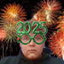

# Seasonal Profile Pictures

A collection of themed profile pictures for different seasons and occasions.

## Current Profile Picture
**Fall**: *Sep 1 - Oct 25*

---

## Schedule

| Period | Theme | Preview | Filename |
|--------|-------|---------|----------|
| Dec 30 - Jan 3 | New Years |  | `newyears.png` |
| Jan 4 - Mar 20 | Winter |  | `winter.png` |
| Mar 21 - May 31 | Spring |  | `spring.png` |
| June 1 - July 2 | Summer |  | `summer.png` |
| July 3 - July 5 | 4th of July |  | `4thofjuly.png` |
| July 6 - Aug 31 | Summer |  | `summer.png` | 
| Sep 1 - Oct 25 | Fall |  | `fall.png` |
| Oct 26 - Nov 1 | Halloween |  | `halloween.png` |
| Nov 2 - Nov 19 | Fall |  | `fall.png` |
| Nov 20 - Nov 30 | Thanksgiving |  | `thanksgiving.png`|
| Dec 1 - 29 | Christmas |  | `christmas.png` | # Yes I like 

Yes I know christmas is super long, I like being in the holiday mood.

## Usage
Current profile picture is always available at: `current.png` (symlink/copy of active theme)